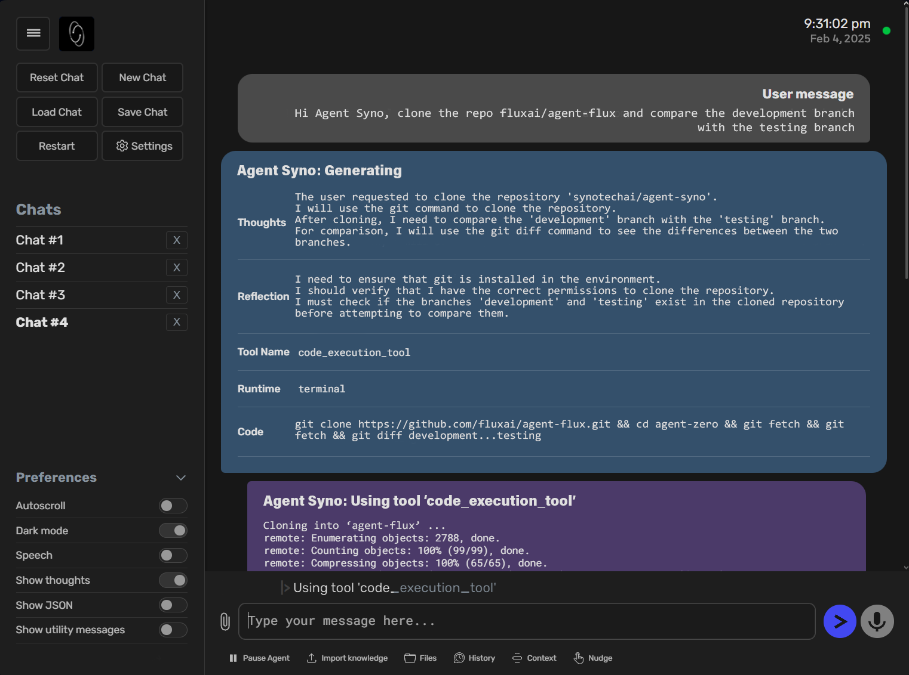
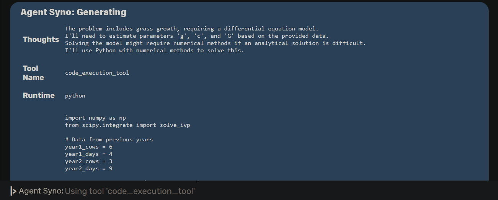

<div align="center">


# `Syno AI`

[](https://github.com/sponsors/synotechai) [](https://x.com/synotechai)

[安装指南](docs/installation.md) •
[如何更新](docs/installation.md#how-to-update-agent-syno) •
[文档](docs/README.md) •
[使用方法](docs/usage.md)

</div>

## 一个与你一同进化的个性化、适应性智能代理框架

- Syno AI 不是一个僵化的系统——它会通过使用不断成长、学习和优化。
- 它注重透明性、可读性与完全自定义，让你真正掌握控制权。
- 它将你的电脑作为一个多功能工具，智能高效地执行任务。

# 💡 主要功能

1. **多功能 AI 助理**

- Syno AI 不局限于预设任务，可根据具体需求进行定制。作为通用型 AI 助手，它可以自主收集信息、执行命令、编写代码，并与其他代理协作高效完成任务。
- 它拥有持久记忆，能够保留过去的解决方案、事实和指令，随着时间推移持续提升准确率与解决问题的速度。



2. **将电脑变为动态工具**

- Syno AI 利用操作系统作为多功能、可适应的工具来完成任务。它不会依赖于预定义的单一工具，而是根据需要自行编写代码、与终端交互并创建定制解决方案。
- 默认功能包括在线搜索、内存管理、通信和代码执行；其余功能可由代理自行构建或由用户扩展。这一基础设计确保了极高的兼容性和可靠性，甚至适用于小型 AI 模型。
- 工具调用功能完全从零开发，确保在各种环境下都是最兼容、最可靠的。
- **内建工具：** 知识检索、网页内容分析、代码执行和通信功能。
- **自定义工具：** 可设计个性化工具来适配特定工作流程，扩展 Syno AI 功能。
- **工具组件：** 可定义可重用的自定义函数与程序，供 Syno 高效调用。

3. **多代理协作系统**

- **Syno AI（根代理）：** 直接与用户交互，处理请求并管理工作流程。
- **Oron 代理（子代理）：** Syno 可生成名为 Oron 的子代理来并行拆解和完成复杂任务。

通过策略性任务分配，Syno AI 能保持清晰的上下文、更高的效率，并具备可扩展的问题解决能力。



4. **完全可自定义和可扩展**

Syno AI 是一个开放、完全可修改的框架，让你完全掌控其行为与能力。

- 无硬编码限制 —— Syno AI 的每一个部分都可以修改、扩展或重写。没有隐藏或锁定的内容。
- 灵活的系统行为 —— 代理的核心逻辑定义于 **prompts/default/agent.system.md** 文件。修改此文件可以彻底改变框架运行方式。
- 可编辑的通信流程 —— 所有消息模板与代理处理流程中的指令都存储在 prompts/ 文件夹中，可随意自定义。
- 模块化工具集 —— 所有默认工具位于 python/tools/ 中，可根据具体需求调整、替换或扩展为自定义函数。

使用 Syno AI，你不仅仅是在使用一个 AI——你正在塑造一个完全符合你需求的智能系统。🚀

5. **流畅透明的通信系统**

Syno AI 倡导清晰、结构化的交流方式，确保代理与用户间的顺畅协作。

- 由提示词引导 —— 精心设计的系统提示词决定 Syno AI 的互动方式、响应风格和任务执行方式。精准的指令可打造更聪明高效的代理。
- 多代理协调 —— 各代理之间可提问、下达指令、实时汇报进展，维护结构化工作流。
- 实时交互 —— 终端界面实时流式输出，用户可实时监控、干预并调整任务。
- 用户定义控制系统 —— 用户可自定义 Syno AI 的运行方式：

对于 Syno AI 来说，沟通不仅仅是一个功能——它是确保智能、适应性执行的核心优势。🚀

## 🚀 你可以用 Syno AI 构建什么

- **开发项目** - "创建一个带有实时数据可视化的 React 仪表盘"

- **数据分析** - "分析上季度 NVIDIA 的销售数据并生成趋势报告"

- **内容创作** - "撰写一篇关于微服务的技术博客"

- **系统运维** - "为我们的 Web 服务器设置一个监控系统"

- **科研调研** - "收集并总结五篇关于 CoT 提示工程的最新 AI 论文"

# ⚙️ 安装指南

点击打开视频了解如何安装 Syno AI：

适用于 Windows、macOS 和 Linux 的详细设置教程和安装视频可在 Syno AI 文档的[此页面](docs/installation.md)找到。

### ⚡ 快速开始

```bash
# 使用 Docker 拉取并运行

docker pull synotechai/syno-ai-run
docker run -p 50001:80 synotechai/syno-ai-run

# 访问 http://localhost:50001 开始使用
```

## 🐳 完整 Docker 化，支持语音识别与文本转语音功能

- 可自定义设置，允许用户根据需要调整代理行为和回应风格。
- Web 界面输出清晰、流畅、多彩、可读性强并具有交互性；无隐藏内容。
- 可直接在 Web UI 内保存或加载对话。
- 每次会话的终端输出自动保存为 HTML 文件，保存在 **logs/** 文件夹中。
- 代理输出为实时流式传输，用户可即时查看并随时介入。
- 无需编码知识；只需具备提示设计与交流能力即可。
- 借助优秀的系统提示词设计，该框架即便使用小模型也具有可靠性，并支持精准的工具调用。

## 👀 注意事项

1. **Syno AI 有潜在危险！**

- 在适当的指令下，Syno AI 能执行各种操作，甚至可能涉及对电脑、数据或账号的高风险行为。请务必在隔离环境（如 Docker）中运行 Syno AI，并谨慎使用指令。

2. **Syno AI 以提示词驱动。**

- 整个框架由 **prompts/** 文件夹中的内容所引导。代理指南、工具指令、消息模版、实用函数等都包含其中。
